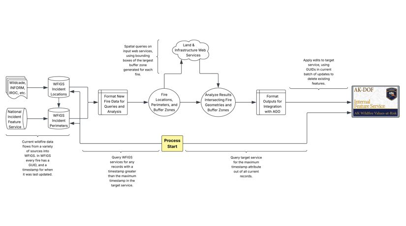

## About
This project aims to expedite an initial assessment of land and infrastructure values that may be impacted by, or are in proximity to, active wildfires in Alaska. The data provided by this assessment should not be viewed as final and authoritative, as development is ongoing throughout the 2025 fire season. Additionally, because input data sources and user needs are expected to change over time, the current configuration and implementation details are likely to change as well.

※<i>Early on a decision was made to deploy a GitHub Pages site from a subdirectory of this repository, which is called <b>docs</b>, per GitHubs requirements. This site gets updated by a process that executes every fifteen minutes. Doing this results in a long and redundant commit history that gets auto-squashed periodically. This is not ideal for maintaining a coherent commit history and will be changed when time allows.</i>

## Products
| Link | Description |
|---------|-------------|
| [AK Wildfire Info Tables](https://con-j-e.github.io/ak-wildfire-values-at-risk/index.html) | Interactive tables for sorting and filtering analysis results in a variety of ways. This product is downstream of the AK Wildfire Values-at-Risk Web Service. |
| [AK Wildfire Values-at-Risk Web Service](https://nifc.maps.arcgis.com/home/item.html?id=107d1dd543a341a8b1764fe97738cfa7) | ArcGIS Online web service (internal to a private group in the NIFC Organization). Analysis results are posted to this endpoint. Pop-ups are configured using Arcade and HTML to dynamically and conditionally display relevant content. |

<h2 align="center" style="font-family:Arial; color:#cccccc;">Processing Pipeline - A General Overview</h2>

  

